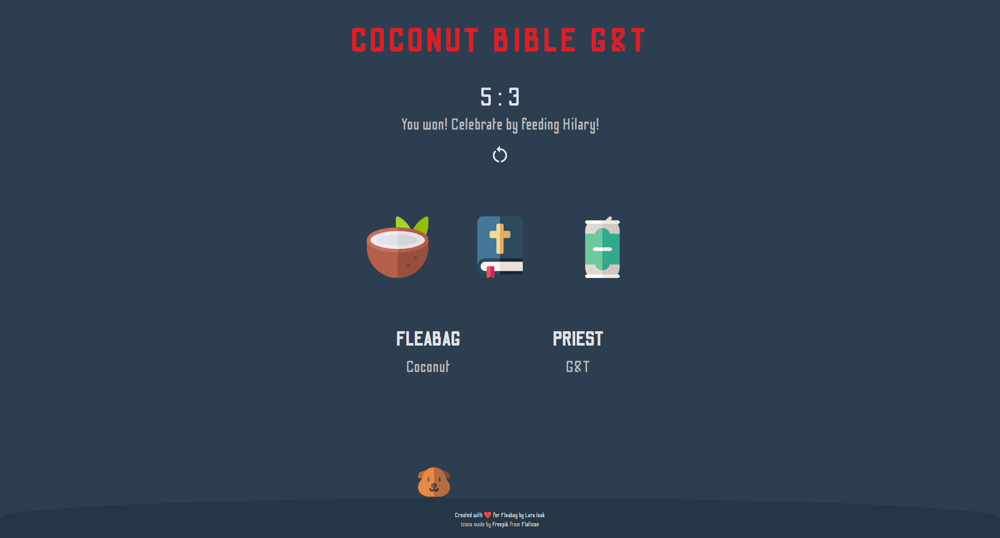

# coconut-bible-g&t

Coconut-Bible-G&T is a variation of a Rock-Paper-Scissors game build with **HTML, CSS & JavaScript** inspired by the TV series, [Fleabag](https://www.imdb.com/title/tt5687612/).

You can play the game [here](https://lara-isak.github.io/coconut-bible-ginandtonic/).

### :game_die:	Game rules
The rules are pretty simple. The player (**Fleabag**) is playing against the machine (**Priest**). Whoever gets to 5 points, wins. :trophy:  
The outcome of each round is determined by 3 simple rules:
1. **Bible** wins over **Coconut** (Bible covers Coconut)
2. **G&T** wins over **Bible** (G&T spills all over Bible)
3. **Coconut** wins over **G&T** (Coconut smashes G&T can)

### :thumbsup: Motivation behind the project

Better understanding of the **JavaScript execution context** and **CSS stacking context**

### :seedling: What I learned
:arrow_right: how to recognize **logical blocks of code** and enclose them in **functions**  
:arrow_right: how to **pass a button value** to a function using **this** keyword  
:arrow_right: how to use **DOM manipulation** to trigger **element transformation**  
:arrow_right: how to use **pseudo elements** to "manipulate" **stacking context**  
:arrow_right: how to utilise the power of **relative length units** (em, vw / vh) and **media queries** to ensure responsivness on various devices 

